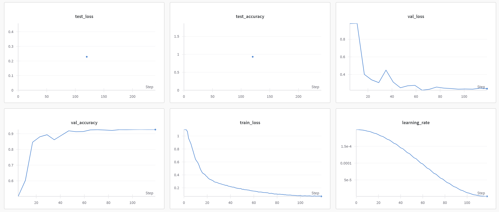

# **Common Test I: Multi-Class Classification**  

## **Task**  
Develop a deep learning model to classify images into three lensing categories using **PyTorch** or **Keras**. Select the most suitable architecture and justify your choice.  

## **Dataset Description**  
**`dataset.zip`** (Google Drive)  
The dataset consists of images from three distinct categories:  
- **No Substructure** – Strong lensing without substructure.  
- **Subhalo Substructure** – Presence of small-scale dark matter subhalos.  
- **Vortex Substructure** – Unique lensing features caused by vortex-like effects.  

✅ Images are **min-max normalized**. Further normalization and augmentation are allowed.  

## **Evaluation Metrics**  
The model is evaluated based on:  
- **ROC Curve** (Receiver Operating Characteristic)  
- **AUC Score** (Area Under the ROC Curve)  

📌 **Goal:** Maximize AUC while ensuring model generalization.  

---

## **Approach & Strategy**  

### **Model Selection**  
The following architectures are explored:  
- **CNN** – Baseline architecture inspired by lensing classification studies.  
- **ResCNN** – CNN with residual connections to enhance feature propagation.  
- **ViT** – Vision Transformer for long-range spatial dependencies.  

### **Training Details**  
- **Loss Function:** Cross-Entropy  
- **Optimizer:** Adam  
- **Scheduler:** Cosine Annealing LR  
- **Data Preprocessing:** Min-max normalization (pre-applied), optional augmentation  

---

## **Usage**  

### **1️⃣ Extract Dataset**  
Convert NPY images into a PyTorch dataset:  
```bash
python scripts/data_proc.py
```

### **2️⃣ Train Model**  
Train using PyTorch or Keras. Training logs, hyperparameters, and outputs are recorded in **WandB**.  
```bash
python scripts/train.py
```
Alternatively, run the Jupyter Notebook:  
```bash
scripts/train.ipynb
```

### **3️⃣ Evaluate & Visualize**  
Generate **ROC-AUC curves** and model analysis:  
```bash
scripts/eval.ipynb
```

---

## **Results & Findings**  

### **Differences in Lens Structures**  
- **No Substructure**: Clean arcs with smooth mass distribution.  
- **Subhalo Substructure**: Distorted arcs due to small-scale gravitational perturbations.  
- **Vortex Substructure**: Complex patterns indicating unconventional gravitational effects.  

### **CNN: Standard Convolutional Approach**  
**Architecture:** Based on [Gravitational Lens Classification via CNNs](https://arxiv.org/abs/1905.04303).  
**Key Feature:** **Adaptive Average Pooling** to reduce overfitting (better than traditional max pooling).  

**Training Results:**  
- Hyperparameters & logs: `test1/logs/2025-3-17-cnn-config.yaml`  
- Training visualization:  
    
- Final test results:   

---

### **ResCNN: Residual Learning for Better Convergence**  
**Why Residual Blocks?**  
Residual connections allow gradients to flow through the network without degradation, making training deeper networks feasible.  

**Key Features:**  
- **Larger receptive fields** using **5x5** and **3x3 kernels** in residual blocks.  
- **Dropout (0.2)** to mitigate overfitting.  

**Training Insights:**  
- **ResCNN converges faster** than vanilla CNN due to skip connections.  
- **More stable gradients**, reducing vanishing/exploding issues.

**Training Results:**  
- Hyperparameters & logs: `test1/logs/2025-3-17-rescnn-config.yaml`
- Training visualization:  
    
- Final test results:  


**Comparison with CNN:**  
- CNN achieves **good performance but struggles with complex structures**.  
- ResCNN maintains performance while being **less prone to overfitting**.  

---

## **Next Steps**  
Experiment with **Vision Transformers (ViT)**.
Try **self-supervised pretraining** before fine-tuning on lens classification.

**Stay tuned for further model improvements!**  
